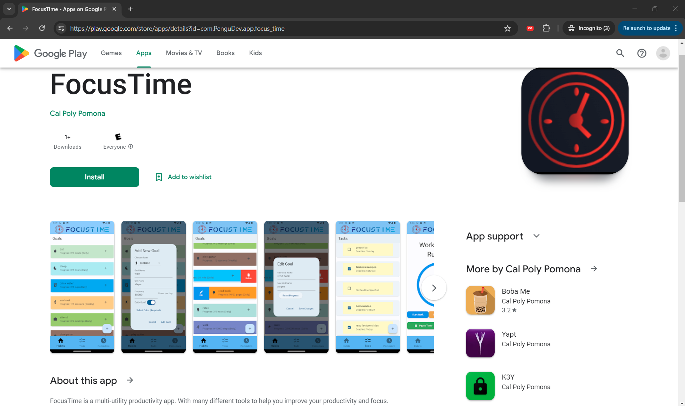
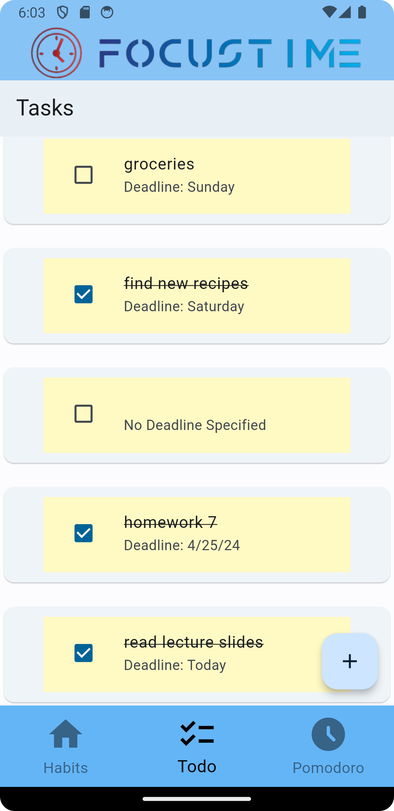
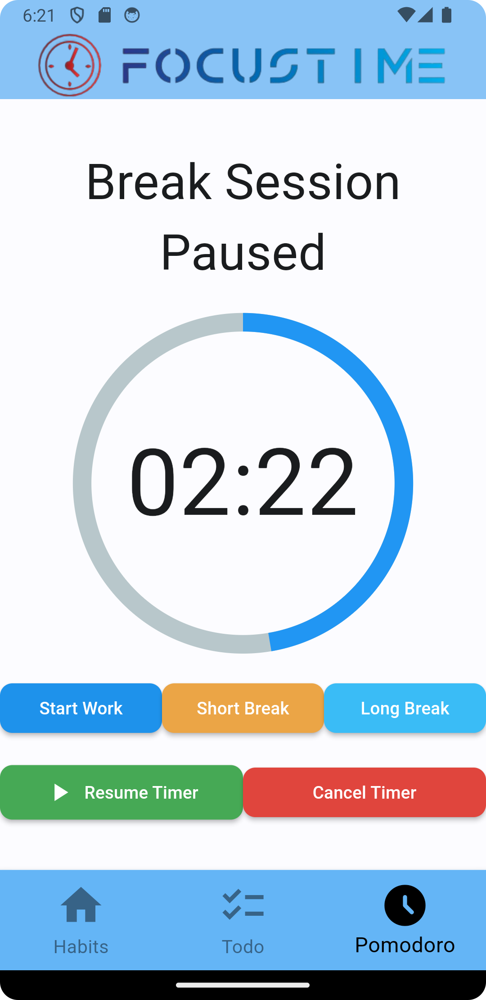

# Link to Download my app on the Google Play Store: https://play.google.com/store/apps/details?id=com.PenguDev.app.focus_time

# Screenshots
  
  
  

Become a Productivity Wizard today by downloading FocusTime!
Improve your life by building life long habits.
Get tasks done and cross them off your todo list.
Focus and lock in on tasks at hand by using the pomodoro timer to know when to work and when to take short breaks.

Everything is currently stored only on local storage on your mobile device.
Everyone can have their own unique personal experience using this app by customizing it to their life. Such as adding their own habits they want to build and tasks they need to get done!

# About
FocusTime: A productivity app to reach daily/weekly habits by logging your progress, get todo items done, and a pomodoro technique study timer.

FocusTime is a multi-utility productivity app. With many different tools to help you improve your productivity and focus. Instead of downloading 3 separate apps, just download this one single app.

Both the Habits page and the Todo list page support CRUD operations.

Use the habits page to add, edit, update, and delete habits. Daily habit progress resets daily and weekly habit progress resets weekly.

Use the todo list page to add, edit, update, and delete todo list items.

Use the pomodoro timer to help you focus and get work done with the work timer and take breaks with the break timer. There is a short break timer (5 minutes) and a long break timer (15 minutes).

# Tech Stack
Flutter Framework and Dart Language

Shared Preferences plugin for local device data storage.

# Useful Info
The Pomodoro Study Technique explained:

https://science.howstuffworks.com/life/inside-the-mind/human-brain/pomodoro-technique.htm

Note: Habit goals and todo list tasks are only stored on the user's local storage on their mobile device. There are no account signups needed and no storage on the cloud.
It’s time to focus today and become a productivity wizard!

Users are recommended to first open the app, use the habits page to update their habit progress, use the todo list page to know what tasks need to be done, and then use the Pomodoro study timer page in order. Users are also recommended to listen to calm relaxing music such as lofi hip hop while studying to stay focused.

Useful Guide to help build habits: https://jamesclear.com/habit-guide
